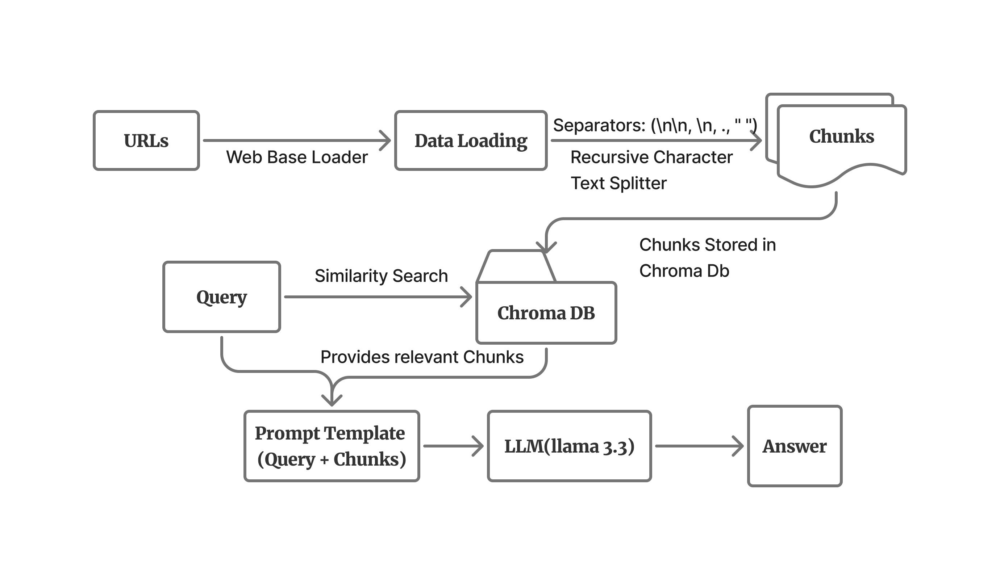
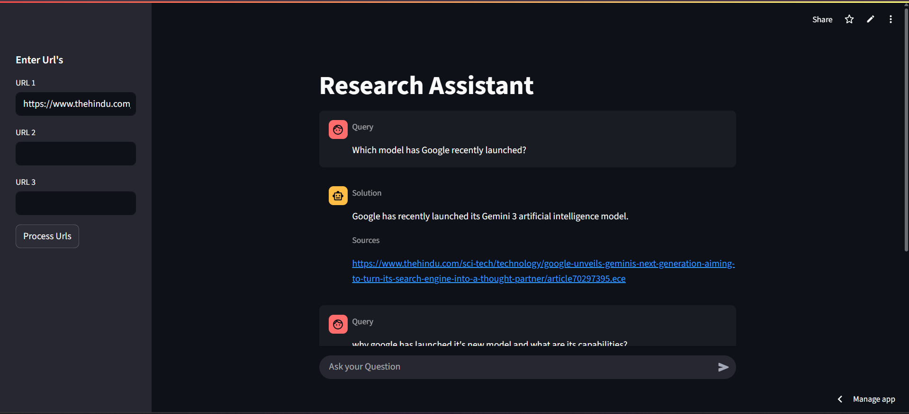
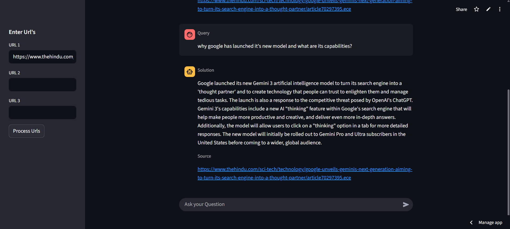

# Universal Research Assistant

An assistant where you can extract relevant information just by dropping a URL of it. 
User can drop URL's and ask questions to receive relevant insights from that doc. 

---
## Features
-  Drop and process the Url to fetch article content.
- The content is fetched using Web Base Loader powered by Langchain.
- The extracted content is divided into chunks using Recursive text splitter.
- Construct a vector store to store embeddings of this chunks into ChromaDB to enable swift retrieval of relevant content.
- Queries are created using Langchain Prompt template and provides flexibility to user and their queries.
- Interacts with the LLM(llama 3 via Groq) by inputting queries to receive answers with source url.

---
## Architecture of Research Assistant


---
## Set-Up
1. Clone the repository
``` bash
  git clone https://github.com/itsmoksh/research-assistant.git
```
2. Run the following command to install all dependencies.
``` bash
  pip install -r requirements.txt
```
3. Create a new .env file with your Groq credentials as follows:
```text
   GROQ_API_KEY = GROQ API KEY HERE
```
4. Run the streamlit app using:
``` bash
  streamlit run main.py
```
---
## Streamlit UI
Here's the screenshot of how Research Assistant Chat-bot works. The article used in this demo 
is from "The Hindu", and it's about the Google new Gen-AI model.


The Url is processed at first, converts the article into document and chunked it. These chunks are stored in the Chroma 
Database in the form of embeddings. Then, it's ready to give the answers.


Here's the next question, asked from the both about the model capabilities and the purpose of launching the model.

---
**Try it out**: [Streamlit App](https://moksh-research-assistant.streamlit.app/)

**Moksh Jain**
[LinkedIn](https://www.linkedin.com/in/itsmoksh/) • [GitHub](https://github.com/itsmoksh)